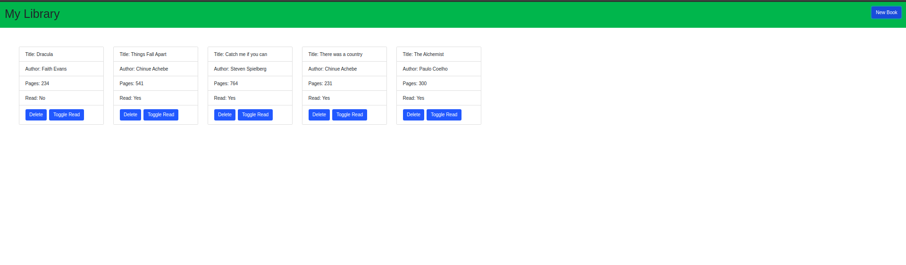

# LIBRARY

<!--
*** Thanks for checking out this README Template. If you have a suggestion that would
*** make this better, please fork the repo and create a pull request or simply open
*** an issue with the tag "enhancement".
*** Thanks again! Now go create something AMAZING! :D
-->

<!-- PROJECT SHIELDS -->

  

  

    This project is part of the Microverse curriculum in JavaScript module!
  

<!-- TABLE OF CONTENTS -->

## Table of Contents

- [About the Project](#about-the-project)
- [Contributors](#contributors)
- [Acknowledgements](#acknowledgements)
- [License](#license)

## About The Project

A Library app where you can add books and mark whether you've read the book or not. You can add and delete book from the library.
Note that this is just a practice app, once the page is refreshed the book lists will go away since we are not using any external storage!

  

[Project live link](https://ebeagusamuel.github.io/Library/)

## Contributing

Contributions, issues and feature requests are welcome! Start by:

- Forking the project
- Cloning the project to your local machine
- `cd` into the project directory
- Run `git checkout -b your-branch-name`
- Make your contributions
- Push your branch up to your forked repository
- Open a Pull Request with a detailed description to the development branch of the original project for a review

### Built With

This project was built using these technologies.

- Javascript
- HTML/CSS
- ESlint
- VSCode editor
- Git-Flow

## Contributors

**Author1**

**Ebeagu Samuel**

- Github: [ebeagusamuel](https://github.com/ebeagusamuel)
- Twitter: [@ebeagu_samuel](https://twitter.com/ebeagu_samuel)
- Linkedin: [Ebeagu Samuel](https://www.linkedin.com/in/ebeagusamuel)
- E-mail: samuelebeagu@gmail.com

**Author2**

​**Adetayo Sunkanmi**

- Github: [@jstloyal](https://github.com/jstloyal)
- Twitter: [@jstloyalty](https://twitter.com/jstloyalty)
- Linkedin: [Adetayo Sunkanmi](https://www.linkedin.com/in/jstloyalty)
- E-mail: jstloyalty@gmail.com

<!-- ACKNOWLEDGEMENTS -->

## Acknowledgements

- [Microverse](https://www.microverse.org/)
- [The Odin Project](https://www.theodinproject.com/)

## License

📝
This project is [MIT](https://opensource.org/licenses/MIT) licensed.
